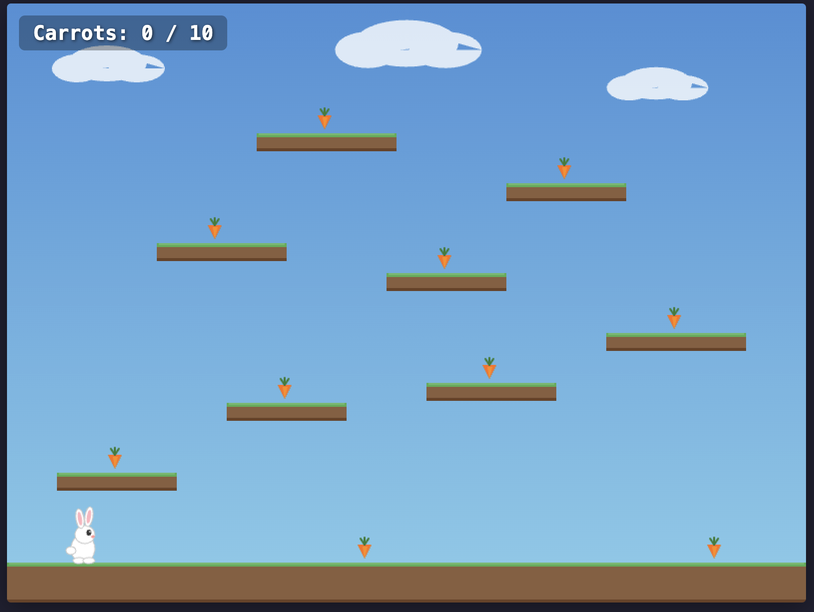

# Rabbit Run

A simple 2D platform game where a rabbit collects carrots.



This is a demo project that shows how to build a game using many small, organized source files that all compile into a single HTML file you can open in any browser. The idea is to keep things tidy during development while still ending up with one portable file you can share or play offline.

It also serves as an example of how to work with an AI coding assistant on game projects — instead of editing one giant file, the modular structure lets the assistant focus on individual files without filling up its context window.

## Getting Started

You'll need **Node.js** to build this project. Node.js is a tool that lets you run JavaScript outside of a browser — it powers the build system that turns all the source files into one HTML file.

### Step 1: Install Homebrew (if you don't have it)

Homebrew is a package manager for macOS that makes it easy to install developer tools. Open the **Terminal** app (you can find it in Applications > Utilities, or search for "Terminal" with Spotlight) and paste this command:

```bash
/bin/bash -c "$(curl -fsSL https://raw.githubusercontent.com/Homebrew/install/HEAD/install.sh)"
```

Follow the on-screen instructions. When it finishes, you may need to close and reopen Terminal.

You can check if Homebrew is working by running:

```bash
brew --version
```

If it prints a version number, you're good.

### Step 2: Install Node.js

With Homebrew installed, run:

```bash
brew install node
```

This installs both Node.js and **npm** (Node Package Manager), which is used to download the project's dependencies.

Verify it worked:

```bash
node --version
npm --version
```

Both should print version numbers.

### Step 3: Install project dependencies

Open Terminal, navigate to the project folder, and run:

```bash
npm install
```

This downloads all the libraries the project needs (Svelte, Vite, etc.) into a `node_modules` folder. You only need to do this once.

## Development

To start a local development server with live reloading:

```bash
npm run dev
```

This opens a URL (usually `http://localhost:5173`) where you can play the game. Any changes you make to the source files will show up instantly in the browser.

Press `Ctrl+C` in Terminal to stop the server.

## Build

To compile everything into a single HTML file:

```bash
bin/build.sh
```

This produces `dist/game.html` — one self-contained file with no external dependencies. You can open it directly by double-clicking it, send it to someone, or host it on any web server.

## How to Play

- **Move left/right:** Arrow keys or A/D
- **Jump:** Space bar, Up arrow, or W
- Collect all 10 carrots scattered across the platforms to win
- If you fall off the bottom, you'll respawn at the starting position

## Tech Stack

For those interested in the technical details:

- **Svelte 5** with runes (`$state`, `$derived`, `$effect`, `$props`) for UI reactivity
- **Vite** as the build tool
- **vite-plugin-singlefile** to inline all JS/CSS into one HTML file
- **Canvas 2D API** for rendering (all art drawn with code, no image files)

## Project Structure

The source code is organized into folders by responsibility:

```
src/
├── main.js                  # Entry point — starts the app
├── App.svelte               # Root component (score, win state)
├── components/
│   ├── GameCanvas.svelte    # The game canvas and loop
│   └── ScoreBoard.svelte    # Score display and win screen
├── engine/
│   ├── gameLoop.js          # Runs the game at 60 frames per second
│   ├── physics.js           # Gravity, movement, collision detection
│   └── input.js             # Reads keyboard input
├── entities/
│   ├── player.js            # Creates the rabbit
│   ├── platform.js          # Creates platforms
│   └── carrot.js            # Creates carrots
├── levels/
│   └── level1.js            # The level layout (where platforms and carrots go)
└── rendering/
    ├── renderer.js          # Draws everything in the right order
    ├── drawBackground.js    # Sky and clouds
    ├── drawPlatform.js      # Dirt and grass platforms
    ├── drawCarrot.js        # Carrot sprites
    └── drawPlayer.js        # The rabbit
```

The game engine (`engine/`, `entities/`, `rendering/`) is plain JavaScript with no framework dependencies. Svelte is only used for the UI layer (score display, win screen), keeping the game loop fast.

## Build Output

The `dist/` directory is created when you run `bin/build.sh`. It contains a single file: `game.html`. All the JavaScript and CSS from the source tree above gets compiled and inlined directly into this one HTML file — no external scripts, stylesheets, or images. The result looks like this:

```html
<!DOCTYPE html>
<html lang="en">
  <head>
    <meta charset="UTF-8" />
    <meta name="viewport" content="width=device-width, initial-scale=1.0" />
    <title>Rabbit Run</title>
    <style>
      * {
        margin: 0;
        padding: 0;
        box-sizing: border-box;
      }
      html, body {
        width: 100%;
        height: 100%;
        overflow: hidden;
        background: #1a1a2e;
      }
      #app {
        width: 100%;
        height: 100%;
        display: flex;
        align-items: center;
        justify-content: center;
      }
    </style>
    <script type="module" crossorigin>var ar <<<....>>> ")});</script>
    <style rel="stylesheet" crossorigin>canvas.svelte-<<<...>>>ht:100%}</style>
  </head>
  <body>
    <div id="app"></div>
  </body>
</html>
```

The `<<<...>>>` sections represent the compiled and minified game code — all ~20 source files bundled into a single inline `<script>` tag and a single inline `<style>` tag. This file can be shared, hosted, or opened locally with no server or internet connection needed.
